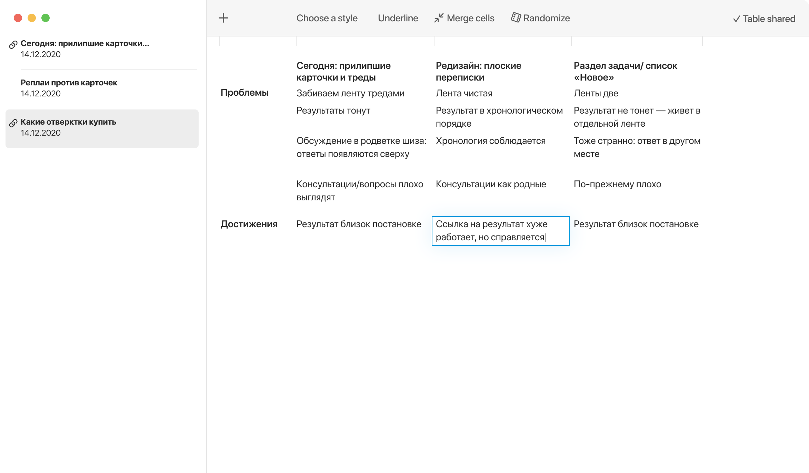

# tablesapp.cloud

[Tablesapp](https://tablesapp.cloud)  is an experimental table design tool. 

## Local files first

1. Tablesapp feels snappy, no matter of internet connection quality.
1. You get control over your data and decide what goes to the cloud.
1. You will never feel “This file has unsaved changes” anxiety.

## Cloud-ready
All tables are ready for one-click cloud sharing. Hosted on Google Firebase.

## Keyboard focused
Tablesapp interface is built around keyboard-only interactions. All actions are available through modeless shortcuts: editing, styling, rearranging. 
 
## Content centered
Tablesapp is free of [chartjunk](https://www.edwardtufte.com/bboard/q-and-a-fetch-msg?msg_id=00040Z) by default. 

